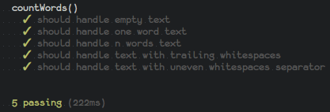

## Introduction

Everything begins in 1999 when [Kent Beck](https://en.wikipedia.org/wiki/Kent_Beck) 
present a new software development methodology based on AGILE: the eXtreme Programming aka _XP_.  
_XP_ define new optimized development practices that improve code production and strength.  
Among the well-known principles of his methodology we can highlight 
**Continuous Integration** and **pair programming**.

The point that pick our interest here is another pillar of his methodology that consists of
driving development with tests, you named it : _TDD_.

TDD is a hot topic because it's costly to set up.
Despite its growing popularity, it can barely find its way.

With the multiplication of running environment, the complexity of web applications
and the rising of Open-Source projects. Maintainers are facing cross compatibility issues
and inconsistency.  
Nowadays, standards are more and more permissive and favours risky behaviours. 
Most of the time systems are able to correct your errors, sometimes 
without even warning you.
Within this context:
- How to flawlessly write functional cross-platform code?
- How to be sure that the newly added code isn't breaking the old one?
- How to be sure that the code behave like it's expected to? 

Starting by adopting strict coding practices is a must,
but tests will be crucial to your code quality.

Fortunately, TDD is bringing an elegant solution to these problems.

## Did you just say TDD?

Test Driven Development, is a development technique that enforce writing tests 
before even writing a single line of code.

In theory, this method requires the attendance of at least two different coders,
one to write the tests and the other write the tested code. That voiding issues
linked to subjectivity.

In practice things are more complicated, sometimes we are developing alone, or
we are writing by ourselves tests that ensure the integrity of a new feature
in a collaborative project.

> Whatever happens, a low-efficient test is more valuable than no test at all.
> The aim is to get used to write some test and to be objective about their writing.

TDD is becoming increasingly popular and requires the willing of everyone to
become mainstream. Any developers concerned about their environment and their legacy
have to ask themselves seriously.  
Test frameworks, guides and documentations about testing are flourishing so you can
get on board easily.

We can split TDD into 5 distinct steps:

1. Write a test.
2. Make it fail.
3. Write the **suitable** code to make the test pass.
4. Check that the test pass.
5. Optimize the code and check that there is no regression.

To simplify this logic we can group these 5 steps in 3 great principles:

- **Test first**, which corresponds to the first two steps.
- **Make it work**, that covers point 3 and 4.
- **Make it better**, which is none other than the 5th step.

Bill Wake defines these three points in a methodology called 
[3A](http://xp123.com/articles/3a-arrange-act-assert/) 
standing for Arrange, Act, Assert.  
He insists on the fact that the order isn't immutable, as such,
_assertion_ can come before _action_, etc...

- **Arranger**: Set up phase of the test environment in which we declare 
variables and functions. 
- **Act**: Phase in which we act on our environment by applying mutations. 
- **Assert**: We make claims about the whole environment 
(variables, functions, parameters).

## TDD 101

For the following test set we'll use EcmaScript 6 and 
[`.assert()`](https://developer.mozilla.org/en-US/docs/Web/API/console/assert) 
method from the browser console: Like so, you can reproduce them at will.

Goal: Write a function `countWords()` that count words.. Duh..

**ITERATION #1**: write and fail of the initial test

First, we write a basic assertion.
```js
console.assert(countWords('') === 0, 'test 0: text is empty');
```
> `Uncaught ReferenceError: countWords is not defined`

After running this snippet, the console reject our test. 
We have to define `countWords()` first.

```js
const countWords = () => {};
console.assert(countWords('') === 0, 'test 0: text is empty');
```
> `Assertion failed: test 0: text is empty`

`countWords()` is now defined and the test fails but the error has changed.  
We now have to define the core of our function.

```js
const countWords = text => text || 0;
console.assert(countWords('') === 0, 'test 0: text is empty');
```
> `undefined`

Nothing is displayed in the console, so the test has passed.

> `countWords()` being simple we'll omit optimisation phases.
> We can also consider the following iterations as optimisations.

**ITERATION #2**: test to handle one word text

Fine. Let's try with a one word text.

```js
const countWords = text => text || 0;
console.assert(countWords('') === 0, 'test 0: text is empty');
console.assert(countWords('nope') === 1, 'test 1: text contains 1 word');
```
> `Assertion failed: test 1: text contains 1 word`

`countWords()` isn't counting properly, let's add some code to pass the test.

```js
const countWords = text => text ? text.split(' ').length : 0;
console.assert(countWords('') === 0, 'test 0: text is empty');
console.assert(countWords('nope') === 1, 'test 1: text contains 1 word');
```
> `undefined`

The test has passed, let's add another common case.

**ITERATION #3**: test to handle several words text

```js
const countWords = text => text ? text.split(' ').length : 0;
console.assert(countWords('') === 0, 'test 0: text is empty');
console.assert(countWords('nope') === 1, 'test 1: text contains 1 word');
console.assert(countWords('tdd is fun bro') === 4, 'test 2: text contains 4 words');
```
> `undefined`

The new test is passing without any modification, let's continue.

**ITERATION #4**: test to handle text containing trailing whitespaces at the beginning and at the end

Let's test the function's robustness.

```js
const countWords = text => text ? text.split(' ').length : 0;
console.assert(countWords('') === 0, 'test 0: text is empty');
console.assert(countWords('nope') === 1, 'test 1: text contains 1 word');
console.assert(countWords('tdd is fun bro') === 4, 'test 2: text contains 4 words');
console.assert(countWords(' so is skateboarding ') === 3, 'test 3: text contains 3 words');
```
> `Assertion failed: test 3: text contains 3 words`

Ouch.. our function isn't tough enough. Let's correct it to handle text containing whitespaces 
at the beginning and at the end.

```js
const countWords = text => text ? text.trim().split(' ').length : 0;
console.assert(countWords('') === 0, 'test 0: text is empty');
console.assert(countWords('nope') === 1, 'test 1: text contains 1 word');
console.assert(countWords('tdd is fun bro') === 4, 'test 2: text contains 4 words');
console.assert(countWords(' so is skateboarding ') === 3, 'test 3: text contains 3 words');
```
> `undefined`

Perfect, the function is improved! Let's add one last test to be sure.

**ITERATION #5**: test to handle text with uneven whitespace separators

```js
const countWords = text => text ? text.trim().split(' ').length : 0;
console.assert(countWords('') === 0, 'test 0: text is empty');
console.assert(countWords('nope') === 1, 'test 1: text contains 1 word');
console.assert(countWords('tdd is fun bro') === 4, 'test 2: text contains 4 words');
console.assert(countWords(' so is skateboarding ') === 3, 'test 3: text contains 3 words');
console.assert(countWords(`  I'm 28, I love $#@! and    multi-spaces  `) === 7, 'test 4: text contains 7 words');
```
> `Assertion failed: test 4: text contains 7 words`

Oh snap..! A specific case again, let's modify the algorithm.
We have to get rid of the useless whitespaces between words.

```js
const countWords = text => text ? text.trim().replace(/\s+/g, ' ').split(' ').length : 0;
console.assert(countWords('') === 0, 'test 0: text is empty');
console.assert(countWords('nope') === 1, 'test 1: text contains 1 word');
console.assert(countWords('tdd is fun bro') === 4, 'test 2: text contains 4 words');
console.assert(countWords(' so is skateboarding ') === 3, 'test 3: text contains 3 words');
console.assert(countWords(`  I'm 28, I love $#@! and    multi-spaces  `) === 7, 'test 4: text contains 7 words');
```
> `undefined`

The final test has passed without making the previous ones fail.

We can notice here that writing tests is an iterative process.  
The optimisation phase implies the writing of a new test that fails 
and set a new iteration.  

Obviously `countWords()` is way under optimised and don't cover every edge cases.
We could have add a check on the `text` param type and counted with a `regex` match like so:

```js
const countWords = text => typeof text === 'string' && text.trim() ? text.match(/\S+\s{0,1}/g).length : 0;
```
The point here is that coding is an incremental process. Each new cycle has to be 
initiated by a particular need and covered by a dedicated test. 

Test writing is simple: we break down our script in a set of assertions,
in which each one corresponds to a specific feature of our algorithm.

Thanks to this process we prevent:
- **regressions**: The passing set of tests is the guaranty that the code stay 
functional despite the algorithm evolution.
- **dead code**: each written piece of code is tested and useful avoiding boilerplate.
- **undocumented code**: each behaviour is documented in a functional way.

## BDD: Tests for everyone

A more agnostic variation from the developer's logic exists and allows 
external attendants to be part of the creating process.

The Behaviour Driven Development, alias BDD, allows to define in a trivial
way the specs of a feature for the non technical staff. This also allow 
developers to understand the overall behaviour without talking about technical details.  

To illustrate this variation let's take a look back at the previous script:

> Note: To execute this code you'll need a _test-runner_ like 
> [Karma](https://karma-runner.github.io), [Mocha](https://mochajs.org) or [Jest](https://facebook.github.io/jest/). 

```js
const countWords = text => typeof text === 'string' && text.trim() ? text.match(/\S+\s{0,1}/g).length : 0;

describe('countWords()', () => {
  it('should handle empty text', () => {
    expect(countWords('')).toBe(0);
  });
  
  it('should handle one word text', () => {
    expect(countWords('nope')).toBe(1);
  });
  
  it('should handle n words text', () => {
    expect(countWords('tdd is fun bro')).toBe(4);
  });
  
  it('should handle text with trailing whitespaces', () => {
    expect(countWords(' so is skateboarding ')).toBe(3);
  });
  
  it('should handle text with uneven whitespaces separator', () => {
    expect(countWords(`  I'm 28, I love $#@! and    multi-spaces  `)).toBe(7);
  });
});
```

Here is the result of the run:



The proofreading is simplified for each non-technical contributors.
  
## Conclusion

TDD is meant to be embed in a [Continuous Integration](https://en.wikipedia.org/wiki/Continuous_integration)
process to ensure that each new `commit` is not breaking the app in any production environment.  

Hope you enjoyed the show and that you're willing to give a shot to TDD
to bring balance and harmony to your code.   

I any case, I can certify that the other coders will be grateful, believe me. 
